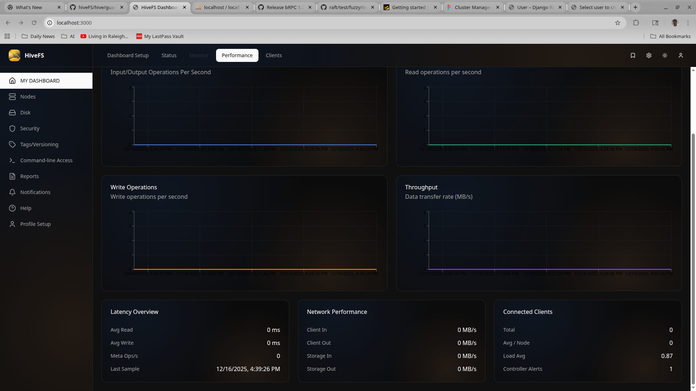
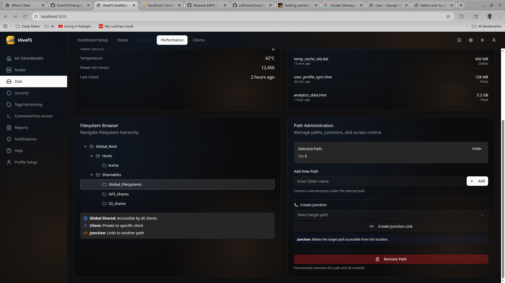
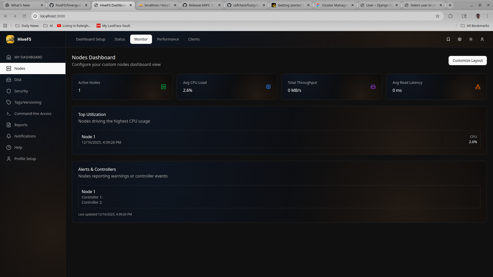

# HiveFS

**HiveFS** is a distributed, secure, SSD-optimized cluster filesystem designed for large-scale, multi-tenant environments where **clients and storage are strictly separated**, **metadata consistency is critical**, and **storage must scale independently of compute**.

HiveFS is built from the ground up as a *shared-nothing* storage system with a **single global filesystem tree**, strong cryptographic identity, and a flexible sharing model that goes beyond traditional cluster filesystems.

> ⚠️ **Status:** HiveFS is under active development. The core architecture is largely implemented, but it is not yet production-ready. The GUI and extended features are in process currently.

---

## Design goals

HiveFS is designed around a few core principles:

- Strict separation of clients and storage
- Predictable performance on SSD
- Strong security by default
- Cloud-friendly *and* appliance-friendly deployment
- Long-term scalability (exabyte → yottabyte class)

---

## Architecture overview

### Clients and storage nodes are never the same

HiveFS enforces a hard separation between **clients** and **storage nodes (SNs)**:

- A **storage node is never a client**
- A **client is never a storage node**
- There is **no practical limit** on the number of clients that can attach

Clients connect using:

- a **high-performance Linux kernel module**
- a user-space **security guard (“Hi-Command”)** responsible for authentication, authorization, and policy enforcement

This design allows client access to scale independently, without coupling client load to storage topology.

---

### Shared-nothing storage nodes

Each storage node is:

- **Shared-nothing**
- Backed by its own **commodity SSD**
- The architecture doesn't limit the number of maximum nodes.
- Adding nodes adds both bandwidth for reading/writing and capacity via internal commodity disk.
- Installed via:
  - Physical ISO
  - AWS AMI
  - Azure machine image

Reads and writes may go through **any storage node**.  
Cluster-wide metadata consistency is maintained via a **Raft-based replicated log**, ensuring all nodes converge on the same filesystem state.

Data is stored in a **custom key-value store optimized for SSD workloads**, featuring:

- delayed deletion
- scheduled garbage collection
- reduced write amplification

---

### Redundancy and scalability

HiveFS uses **4+2 erasure coding** to provide:

- tolerance for node failures
- efficient storage utilization
- horizontal scalability

The design explicitly targets extremely large deployments. While a final release is not yet available, the architecture allows for **exabyte- and beyond-scale storage**.

---

## Security model

Security is a first-class concern in HiveFS.

- All communication can be encrypted using **256-bit TLS**
- **Mutual TLS (mTLS)** is used for:
  - node-to-node authentication
  - client authentication
- Identity is rooted in a **client-owned CA authority**, with explicit trust validation

There is no implicit trust between components.  
Every node and client must prove its identity cryptographically.

---

## A single global filesystem tree — with flexibility

Unlike many clustered filesystems that are strictly shared-only, HiveFS exposes a **single global filesystem tree** that supports:

- **Node-specific branches**
- **Shared branches**
- **Exported branches** (NFS, WebDAV, S3)

HiveFS also introduces a **junctioning system** that allows parts of the tree to be dynamically re-grafted:

- Paths originally private to a single client can later be shared
- Subtrees can be exposed at different locations for different clients or client groups
- Not all clients are required to follow the same directory structure

This makes HiveFS suitable for:

- multi-tenant environments
- cross-team data sharing
- hybrid private/shared data layouts

---

## Screenshots & UI Overview

While HiveFS is still under active development, the following screenshots illustrate the direction of the system and how the filesystem, nodes, and metadata are exposed to operators.

> These screenshots represent an early but functional UI and are intended to demonstrate architectural intent rather than final visual design. Note that this is a section of current on-going development and most of these screens have already been consolidated into a much better view, but they show the features of the filesystem and are a good introduction. We will post updates shortly.

---

### Cluster Dashboard

The main dashboard provides a high-level view of cluster performance and health, including:

- aggregate I/O and throughput metrics
- latency and utilization trends
- early warning indicators for storage and node health

This view is intended to give operators immediate feedback on cluster behavior without needing to inspect individual nodes.

---

### Global Filesystem Layout

This view shows the **single global filesystem tree**, including:

- shared and node-specific branches
- logical divisions of storage across the cluster
- how data is organized independently of physical node boundaries

The filesystem is presented as a unified hierarchy, even though data is physically distributed across shared-nothing storage nodes.

---

### File Versioning & Tags

HiveFS includes native file versioning and tagging:

- tracks block-level changes as files are modified
- retains multiple historical snapshots of file contents
- allows reverting files to earlier versions on demand

This mechanism is designed to provide lightweight, filesystem-level version control without requiring external snapshot systems.

---

### Storage Node Health

The node dashboard shows per-node health and status, including:

- availability and responsiveness
- storage utilization
- participation in cluster quorum and metadata replication

This view is intended to make node-level issues visible quickly while still encouraging operators to think in terms of the cluster as a whole.

---

## Deployment philosophy

HiveFS is designed as a **quasi-appliance**:

- Core control services run directly on the host
- User-facing services (API/UI) run in containers
- Designed to operate on:
  - physical hardware
  - cloud instances with attached block storage

While Kubernetes-based deployments may be supported in the future, HiveFS is **not dependent on Kubernetes** and does not require it to function correctly.

---

## Design philosophy: operational sanity

**HiveFS is written by a storage engineer, for storage engineers.**

The design is heavily influenced by years of operating large, complex storage systems that were fragile, over-configured, or required constant human intervention to remain healthy. HiveFS intentionally prioritizes **operational sanity** over exposing endless tuning knobs.

Wherever possible, systems are designed to be:

- deterministic
- automated
- self-correcting under pressure
- predictable during failure

This does *not* mean HiveFS attempts to turn untrained users into storage engineers. Instead, the goal is to **reduce cognitive load**, minimize routine firefighting, and allow experienced operators to focus on real problems instead of babysitting the system.

---

### Automation with intent

HiveFS automates common operational tasks by default:

- Installation is **fully hands-off** once initiated
- Node enrollment, identity, and trust are handled automatically
- Health monitoring and alerting are integrated into the core system

Alerting is not treated as a passive reporting mechanism. Wherever possible, HiveFS attempts to **stabilize and repair the system first**, *while* alerts are being generated and distributed.

---

### Example: proactive space management

As a concrete example, the metadata and snapshot volume manager intentionally maintains **reserved emergency capacity**.

If a filesystem encounters a space-related error condition, HiveFS can:

- automatically expand the affected filesystem to prevent immediate downtime
- continue serving requests while operators are notified
- allow reclaimed space to be returned later once the condition is resolved

The goal is to prevent avoidable outages caused by short-lived or recoverable conditions, without hiding the underlying issue from operators.

---

### Designed to support experts, not replace them

HiveFS does not attempt to abstract away storage engineering concepts entirely. Instead:

- failure modes are explicit
- behavior is observable
- automation is conservative and explainable

The system is designed to be **stress-reducing** for experienced operators — not to obscure reality or eliminate the need for understanding how storage works.

In short, HiveFS aims to elevate the day-to-day operational experience for skilled storage engineers, rather than simplify the problem space beyond recognition.

---

## Project status

HiveFS is currently:

- under heavy development
- stabilizing core identity and PKI systems
- refining storage, garbage collection, and metadata handling

If you are interested in:

- distributed storage systems
- filesystem design
- secure cluster architectures

…this project may be worth following or contributing to as it evolves.
