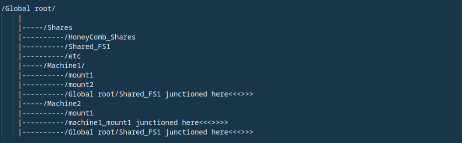

# hiveFS
A Hive Mind Filesystem

HiveFS is a hive mind filesystem for physical Linux, (Windows?) and VMWare/Nutanix/Cloud datastore.

(This project is still in development.)

What is a hive mind filesystem? Well, in the past virtualization has hit everything, even storage
can be virtualized. Why not the filesystem itself? HiveFS is a truely virtual global filesystem.
A sort of filesystem hypervisor. In other words, it negotiates with the living kernel on a machine 
and makes the underlying storage look like one or many real, live filesystems, but on the backend, 
all data is stored in one global virtual de-dupe pool. No data has to be stored on local disk or 
SAN mounted. Although, it's recommended to have a small local cache on SSD disk just to make sure 
remote speed is no slower than local speed. The original goal of hiveFS was not to produce a 
clustered or NFS-style shared filesystem, but rather, by nature of its original intended design 
architecture it inherently acts as both. 

There are 3 required and one optional companents to the "Hive" in general:
1. The central "Hive" is one or more server(s), storage appliances, installed via ISO image. 
   The ISO install will setup an embedded linux system and configure all storage behind the node
   for use as a blob of storage in the hive. From that point the storage can be managed without
   any traditional storage management (such as zoning, lun management, etc) since it is a
   virtual filesystem. All management is done from the hive node's GUI or the client host CLI.
   Adding nodes adds both the ability to attach more storage via PCI slots and distribution of
   incoming reads/writes for more bandwidth. The software load balances across nodes. Backend 
   storage can be anything locally attached but the hive is designed and tuned specifically for 
   SSD (especially NVME). HSD is not recommended.

2. HiveFS is a kernel module that takes a small local disk and builds a superblock on it and cache.
   The superblock allows the FS to load and then points it to the central hive for inode data. A small 
   configurable cache locally on the disk acts as NVRAM on a storage array acts. In other words, in 
   a power outage, the local cache keeps data consistent. Both the superblock and NVRAM area can be 
   very small, on the order of less than 1GB for typical use. Cache is not strictly required, but
   without it there is a risk of data loss and a slight speed loss.

3. Hi_Command is a user-space program that runs on the same linux client as HiveFS. Hi_Command sets 
   up FIFO queues with the kernel module and accepts data from the kernel to be sent over ethernet to 
   the central hive. In other words, its a user space program that implements the protocol necessary 
   to communicate. Using insecure network comms from the linux kernel isn't a good idea. By moving this
   to user space, it can use TLS encryption and higher-level token authentication, etc.

4. HoneyComb is an optional node server install ISO that can be added which has the hive software to
   access the datastore, the hiveFS kernel module, and hi_command installed. It can access storage 
   high speed and provide a front-end for NFS or webdav protocols for use in physical or cloud 
   infrastructure. This extendeds the inherent block archtecture of the hive to file and object storage. 
   Since the Honeycomb runs the hive software, it can also act as a full particupating member of the hive 
   and accept client communication to store data. However, it will hand off communication from hive 
   clients as load gets higher (from contention with local NFS/Webdev reads/writes).

HiveFS is designed by architecture to easily expand across a hybrid cloud or multi-cloud setup by using 
local or cloud-vendor based SSD block storage and the hive can be installed into virtual machines in any 
cloud. The clients do not need to be local to the hive install, however, to avoid storage timeouts they 
should have a link with reasonable communication speed.

And again, regardless of O/S, application, or other factors, hiveFS is designed to be globally de-dupable 
across all volumes, hosts, and backend storage. In addition some compression is applied. However, because 
keeping only one copy of every block of data is a very bad idea, the hive is designed to be at least 3 nodes 
with the data split into 3 copies. It does support a single node or dual-node (with replication to the second 
node). However, whether you have 3 nodes or twenty, at least 3 copies of all data will be kept by doing 
split-writes across the nodes (the number of copies is cofigurable from 3+ or replication for 2). Single copy 
is possible for small global filesystems and supported but carries the risk of loss of data, so is prefereable
only for test environments.

File versioning. A file can have a configurable number of historical copies as a backup method to go back to 
previous versions of that file/dir. Replication covers large-scale outages, so traditional backup is built-in 
to the filesystem architecture by the way these two functions behave. Further, since a directory structure can 
be modified on the fly and new mounts advertised, it supports the same live mount function as today's CDM-based software via the Honeycomb server (by cloning a dir/filesystem and mounting to the desires host(s)).

(Note that the more file versioning copies are kept, the more old data blocks must stay around and not cleaned.)

Extended ACLs and extended file meta-data (for use in web-based file tagging) is intended to be supported.

Clustered access. Because all storage is contained in one global filesystem, hosts can have their own filesystem 
or share filesystems with other hosts. In other words, the global filesystem is layed out like this:

Since it's a global filesystem, so long as permissions allow, you can junction any dirs whatever machines you 
like and they become either subdirectories of existing mounts or are advertised as new filesystems to be mounted. 
You can have a single host as owner of an FS to allow the host admin to control permissions, or you can allow the 
hive to own a directory as a shared filesystem with permissions controlled by the hive admin. Even dirs owned
by only one host, such as mount1 by machine1 and machine2 above, are still de-duped against each other.
